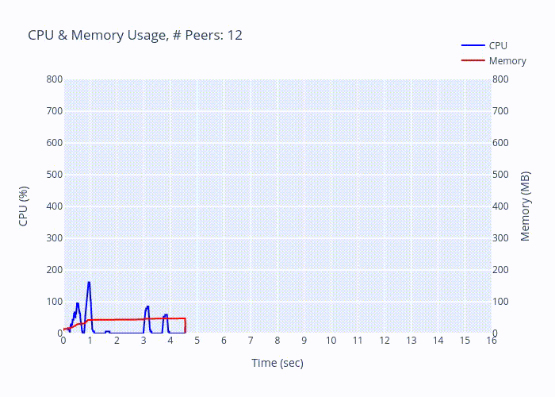
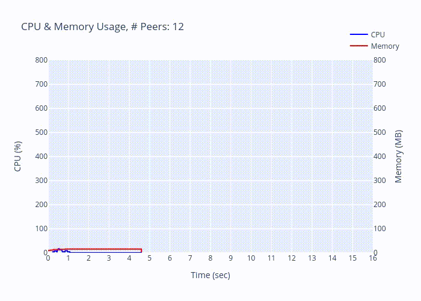

## Quick Usage

1. For eval and query, clone this project and build it.

    ```bash
    cargo build --release --bin z_eval --bin z_query
    ```

2. Clone the [Eclipse Zenoh](https://github.com/eclipse-zenoh/zenoh), build the zenohd,
    ```bash
    cargo build --release --bin zenohd
    ```
    and specify the zenohd in the running script _./run_test.sh_.

    ```bash
    #!/usr/bin/env bash

    ROUTER_PROGRAM_PATH="YOUR_ZENOHD_PATH" <-- HERE
    EVAL_PROGRAM_PATH="./target/release/z_eval"
    QUERY_PROGRAM_PATH="./target/release/z_query"
    ```

3. Remove the restriction of number of file descripter to avoid the "too many opening file issue".

    ```bash
    ulimit -n unlimited
    ```

4. Launch the testing script.

    ```bash
    ./run_test.sh
    ```

    The default testing config is

    _Peer Mode_

    | Node   | Name    | Number  | Multicast | Mode   | Timeout |
    | -      | -       | -       | -         | -      | -       |
    | Router | zenohd  | 1       | Off       | Router | N/A     |
    | Eval   | z_eval  | 12 ~ 48 | Off       | Peer   | 15s     |
    | Query  | z_query | 1       | Off       | Peer   | 15s     |

    with topology

    ```mermaid
    flowchart TD
        B{{Router}}
        A0(Eval #0) <--> B
        A1(Eval #1) <--> B
        An(Eval #n) <--> B
        C(Query) <--> B
    ```

    and some varied modes are

    _Peer Mode (peers autoconnect disabled)_: Peer Mode (default) + Eval peers_autoconnect disabled

    _Client Mode_: Peer Mode (default) + Eval set to Client mode

    **Note**: we only switch Eval between Client/Peer mode currently.

## Experimental Results

### Environments

* OS: Archlinux with kernel 5.18.3
* CPU: i5-10300H CPU @ 2.50GHz, 8 hyper threads
* MEM: 16GB
* Zenoh version: 393843854f012ca8bddedd963125470d3a07477c

### Results

These logs represent whether the number of replies is exactly equal to the number of registered eval.
In summary, Peer Mode (peers autoconnect disabled) and Client Mode work nicely.

<details>
<summary>Peer Mode (default)</summary>

```bash
Testing 12 peers ... failed.
Testing 13 peers ... passed.
Testing 14 peers ... passed.
Testing 15 peers ... passed.
Testing 16 peers ... failed.
Testing 17 peers ... passed.
Testing 18 peers ... failed.
Testing 19 peers ... failed.
Testing 20 peers ... failed.
Testing 21 peers ... passed.
Testing 22 peers ... passed.
Testing 23 peers ... passed.
Testing 24 peers ... failed.
Testing 25 peers ... failed.
Testing 26 peers ... passed.
Testing 27 peers ... failed.
Testing 28 peers ... failed.
Testing 29 peers ... failed.
Testing 30 peers ... failed.
Testing 31 peers ... failed.
Testing 32 peers ... failed.
Testing 33 peers ... failed.
Testing 34 peers ... failed.
Testing 35 peers ... failed.
Testing 36 peers ... failed.
Testing 37 peers ... failed.
Testing 38 peers ... failed.
Testing 39 peers ... failed.
Testing 40 peers ... failed.
Testing 41 peers ... failed.
Testing 42 peers ... failed.
Testing 43 peers ... failed.
Testing 44 peers ... failed.
Testing 45 peers ... failed.
Testing 46 peers ... failed.
Testing 47 peers ... failed.
Testing 48 peers ... failed.
```

</details>


<details>
<summary>Peer Mode (peers autoconnect disabled)</summary>

```bash
Testing 12 peers ... passed.
Testing 13 peers ... passed.
Testing 14 peers ... passed.
Testing 15 peers ... passed.
Testing 16 peers ... passed.
Testing 17 peers ... passed.
Testing 18 peers ... passed.
Testing 19 peers ... passed.
Testing 20 peers ... passed.
Testing 21 peers ... passed.
Testing 22 peers ... passed.
Testing 23 peers ... passed.
Testing 24 peers ... passed.
Testing 25 peers ... passed.
Testing 26 peers ... passed.
Testing 27 peers ... passed.
Testing 28 peers ... passed.
Testing 29 peers ... passed.
Testing 30 peers ... passed.
Testing 31 peers ... passed.
Testing 32 peers ... passed.
Testing 33 peers ... passed.
Testing 34 peers ... passed.
Testing 35 peers ... passed.
Testing 36 peers ... passed.
Testing 37 peers ... passed.
Testing 38 peers ... passed.
Testing 39 peers ... passed.
Testing 40 peers ... passed.
Testing 41 peers ... passed.
Testing 42 peers ... passed.
Testing 43 peers ... passed.
Testing 44 peers ... passed.
Testing 45 peers ... passed.
Testing 46 peers ... passed.
Testing 47 peers ... passed.
Testing 48 peers ... passed.
```

</details>

<details>
<summary>Client Mode</summary>

```bash
Testing 12 peers ... passed.
Testing 13 peers ... passed.
Testing 14 peers ... passed.
Testing 15 peers ... passed.
Testing 16 peers ... passed.
Testing 17 peers ... passed.
Testing 18 peers ... passed.
Testing 19 peers ... passed.
Testing 20 peers ... passed.
Testing 21 peers ... passed.
Testing 22 peers ... passed.
Testing 23 peers ... passed.
Testing 24 peers ... passed.
Testing 25 peers ... passed.
Testing 26 peers ... passed.
Testing 27 peers ... passed.
Testing 28 peers ... passed.
Testing 29 peers ... passed.
Testing 30 peers ... passed.
Testing 31 peers ... passed.
Testing 32 peers ... passed.
Testing 33 peers ... passed.
Testing 34 peers ... passed.
Testing 35 peers ... passed.
Testing 36 peers ... passed.
Testing 37 peers ... passed.
Testing 38 peers ... passed.
Testing 39 peers ... passed.
Testing 40 peers ... passed.
Testing 41 peers ... passed.
Testing 42 peers ... passed.
Testing 43 peers ... passed.
Testing 44 peers ... passed.
Testing 45 peers ... passed.
Testing 46 peers ... passed.
Testing 47 peers ... passed.
Testing 48 peers ... passed.
```
</details>

### Observation

The following logs are some interesting observations but not definitely failed on test.
That is it may still received the correct number of replies at that time.

<details>
<summary>Failed to reply</summary>

```
[Eval] Peer #11 received query /key/*
[Eval] Peer #11 received query /key/*
[Eval] Peer #11 received query /key/*
[Eval] Peer #11 received query /key/*
[Eval] Peer #11 received query /key/*
[Eval] Peer #11 received query /key/*
[Eval] Peer #11 received query /key/*
[Eval] Peer #11 received query /key/*
[Eval] Peer #11 received query /key/*
[Eval] Ended.
```

</details>

<details>
<summary>Received repeated queries</summary>

```bash
[Eval] Peer #23 received query /key/*
[Eval] Peer #23 received query /key/*
[Eval] Peer #23 received query /key/*
[Eval] Peer #23 received query /key/*
[Eval] Peer #23 received query /key/*
...
[Eval] Peer #11 received query /key/*
[Eval] Peer #11 received query /key/*
[Eval] Peer #11 received query /key/*
[Eval] Peer #11 received query /key/*
[Eval] Peer #11 received query /key/*
...
[Query] Received reply 'Hi, I'm peer #12.' from '/key/12'
[Query] Received reply 'Hi, I'm peer #1.' from '/key/1'
[Query] Received reply 'Hi, I'm peer #28.' from '/key/28'
[Query] Received reply 'Hi, I'm peer #24.' from '/key/24'
[Query] Received reply 'Hi, I'm peer #26.' from '/key/26'
[Query] Received reply 'Hi, I'm peer #27.' from '/key/27'
[Query] Received reply 'Hi, I'm peer #30.' from '/key/30'
[Query] Received reply 'Hi, I'm peer #21.' from '/key/21'
```

</details>


<details>
<summary>[ERROR] Received LinkState</summary>

```bash
[2022-06-20T16:52:54Z ERROR zenoh::net::routing::network] [Peers network] Received LinkState from 0E85CB08CE8B42C4B5FC36663D5CDE24 with unknown link mapping 1
[2022-06-20T16:52:54Z ERROR zenoh::net::routing::network] Received LinkState from 0E85CB08CE8B42C4B5FC36663D5CDE24 with unknown node mapping 16
[2022-06-20T16:52:54Z ERROR zenoh::net::routing::network] Received LinkState from 0E85CB08CE8B42C4B5FC36663D5CDE24 with unknown node mapping 9
[2022-06-20T16:52:54Z ERROR zenoh::net::routing::network] Received LinkState from 0E85CB08CE8B42C4B5FC36663D5CDE24 with unknown node mapping 8
[2022-06-20T16:52:54Z ERROR zenoh::net::routing::network] Received LinkState from 0E85CB08CE8B42C4B5FC36663D5CDE24 with unknown node mapping 8
[2022-06-20T16:52:54Z ERROR zenoh::net::routing::network] Received LinkState from 0E85CB08CE8B42C4B5FC36663D5CDE24 with unknown node mapping 20
```

</details>

<details>
<summary>[ERROR] Unable to connect</summary>

```bash
[2022-06-20T17:54:52Z ERROR zenoh::net::runtime::orchestrator] Unable to connect to any of [EndPoint { locator: Locator { inner: "tcp/127.0.0.1:7447", metadata: None }, config: None }]!  at /home/circle/.cargo/git/checkouts/zenoh-cc237f2570fab813/ec5046d/zenoh/src/net/runtime/orchestrator.rs:110.
```

</details>


<details>
<summary>[WARN] Unable to connect</summary>

```bash
[2022-06-20T16:51:19Z WARN  zenoh::net::runtime::orchestrator] Unable to connect any locator of scouted peer 7D19737F43C946798942D06314DAF0D1 : [Locator { inner: "tcp/192.168.42.53:44673", metadata: None }]
[2022-06-20T16:51:19Z WARN  zenoh::net::runtime::orchestrator] Unable to connect any locator of scouted peer 7D19737F43C946798942D06314DAF0D1 : [Locator { inner: "tcp/192.168.42.53:44673", metadata: None }]
[2022-06-20T16:51:19Z WARN  zenoh::net::runtime::orchestrator] Unable to connect any locator of scouted peer 7D19737F43C946798942D06314DAF0D1 : [Locator { inner: "tcp/192.168.42.53:44673", metadata: None }]
[2022-06-20T16:51:19Z WARN  zenoh::net::runtime::orchestrator] Unable to connect any locator of scouted peer 7D19737F43C946798942D06314DAF0D1 : [Locator { inner: "tcp/192.168.42.53:44673", metadata: None }]
[2022-06-20T16:51:19Z WARN  zenoh::net::runtime::orchestrator] Unable to connect any locator of scouted peer 7D19737F43C946798942D06314DAF0D1 : [Locator { inner: "tcp/192.168.42.53:44673", metadata: None }]
[2022-06-20T16:51:19Z WARN  zenoh::net::runtime::orchestrator] Unable to connect any locator of scouted peer 7D19737F43C946798942D06314DAF0D1 : [Locator { inner: "tcp/192.168.42.53:44673", metadata: None }]
[2022-06-20T16:51:20Z WARN  zenoh::net::runtime::orchestrator] Unable to connect any locator of scouted peer 7D19737F43C946798942D06314DAF0D1 : []
[2022-06-20T16:51:20Z WARN  zenoh::net::runtime::orchestrator] Unable to connect any locator of scouted peer 7D19737F43C946798942D06314DAF0D1 : []
[2022-06-20T16:51:20Z WARN  zenoh::net::runtime::orchestrator] Unable to connect any locator of scouted peer 7D19737F43C946798942D06314DAF0D1 : []
[2022-06-20T16:51:20Z WARN  zenoh::net::runtime::orchestrator] Unable to connect any locator of scouted peer 7D19737F43C946798942D06314DAF0D1 : []
[2022-06-20T16:51:20Z WARN  zenoh::net::runtime::orchestrator] Unable to connect any locator of scouted peer 7D19737F43C946798942D06314DAF0D1 : []
[2022-06-20T16:51:20Z WARN  zenoh::net::runtime::orchestrator] Unable to connect any locator of scouted peer 7D19737F43C946798942D06314DAF0D1 : []
[2022-06-20T16:51:20Z WARN  zenoh::net::runtime::orchestrator] Unable to connect any locator of scouted peer 7D19737F43C946798942D06314DAF0D1 : []
```

</details>


## Discussion

### Flamegraph Analysis on Eval

A obvious bottleneck in Peer Mode occurs at zenoh::net::rounting::Network::remove_detached_nodes, which is not observed in the case of Client Mode.
We tried to alternative methods like use hashmap to eliminate the cost of [get_idx (O(n))](https://github.com/eclipse-zenoh/zenoh/blob/f733795d527f23757fe4ed6715443c904a40abb4/zenoh/src/net/routing/network.rs#L139-L143) and skip [remove_detached_nodes](https://github.com/eclipse-zenoh/zenoh/blob/f733795d527f23757fe4ed6715443c904a40abb4/zenoh/src/net/routing/network.rs#L618-L631) to workaround the expensive DFS graph traversal. But the CPU intensive consumption still remain in the peer mode.

Flamegraphs
* [Peer Mode](./analysis/flamegraph/peer.svg)
* [Client Mode](./analysis/flamegraph/client.svg)
* [Peer Mode (use hashmap)](./analysis/flamegraph/use-hashmap.svg)
* [Peer Mode (skip the function remove_detached_nodes)](./analysis/flamegraph/skip-remove-detached-nodes.svg)


### CPU & Memory Usage Analysis on Eval

| Peer Mode                           | Client Mode                           |
| -                                   | -                                     |
|  |  |
